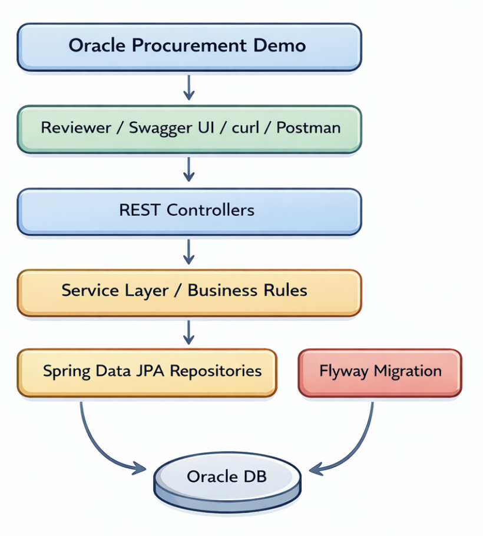

# Oracle Procurement Demo

Small recruiter-friendly backend project built with **Java 21**, **Spring Boot 4**, **Oracle Database**, **Flyway**, **Swagger/OpenAPI**, and **Docker**.

This project models a simple procurement workflow with **suppliers** and **purchase orders**. It focuses on the backend concerns that matter in reviews and interviews: **clean API design, validation, persistence, workflow rules, database migrations, testing, and low-friction local setup**.

---

## What this project demonstrates

- REST API design with Spring Boot 4
- Oracle-backed persistence with Spring Data JPA
- Database migrations with Flyway
- Validation and centralized exception handling
- Simple procurement workflow rules
- Swagger/OpenAPI documentation for easy API review
- Automated tests across service, controller, and integration levels
- Docker-based local setup for reproducible reviewing
- Published Docker image for one-command review

---

## Scope

The project intentionally stays small and practical.

### Implemented features

- Supplier CRUD
- Purchase order CRUD
- Purchase order line items
- Workflow actions:
  - submit
  - approve
  - cancel
- Status summary endpoint
- Validation and error responses
- Flyway-based schema management
- Swagger/OpenAPI UI
- Dockerized Oracle database
- Dockerized application setup for easy review

### Workflow idea

A purchase order starts as a draft and can then move through a small approval flow.

Example lifecycle:

`DRAFT -> SUBMITTED -> APPROVED`

Cancellation is also supported according to the business rules implemented in the service layer.

---

## Tech stack

- Java 21
- Spring Boot 4
- Spring Web MVC
- Spring Data JPA
- Oracle Database
- Flyway
- Hibernate Validator
- SpringDoc OpenAPI / Swagger UI
- JUnit 5
- Mockito
- Docker Compose

---

## Architecture overview



---

## Package structure

```md 
src
├─ main
│  ├─ java/com/example/oracleprocurementdemo
│  │  ├─ common/exception
│  │  ├─ config
│  │  ├─ supplier
│  │  │  ├─ controller
│  │  │  ├─ dto
│  │  │  ├─ entity
│  │  │  ├─ repository
│  │  │  └─ service
│  │  └─ purchaseorder
│  │     ├─ controller
│  │     ├─ dto
│  │     ├─ entity
│  │     ├─ repository
│  │     └─ service
│  └─ resources
│     ├─ db.migration
│     ├─ application.yml
│     └─ application-dev.yml
└─ test
   ├─ java/com/example/oracleprocurementdemo
   └─ resources/application-test.yml
```

---

## Quick review path

This is the fastest way to review the project.

### Prerequisites

* Docker Desktop installed and running
* Port `8080` free for the application
* Port `1521` free for Oracle

### Start everything

```bash
docker compose up -d --wait --wait-timeout 600
```

### Open

* Swagger UI: `http://localhost:8080/swagger-ui.html`
* OpenAPI docs: `http://localhost:8080/v3/api-docs`

### Stop everything

```bash
docker compose down
```

### Full reset

If you want to start with a completely fresh Oracle database:

```bash
docker compose down -v
docker compose up -d --wait --wait-timeout 600
```

This removes the Oracle volume and recreates the schema from scratch through Flyway.

---

## Why the reset command may matter

The Oracle container initializes database users and passwords on first startup.

If the database credentials are changed later, the existing Oracle volume will still contain the old initialized state. In that case, use:

```bash
docker compose down -v
```

to fully reset the database before starting again.

---

## Alternative: run the database in Docker and the app locally

This is useful for development.

### 1. Start Oracle

```bash
docker compose up -d oracle --wait --wait-timeout 600
```

### 2. Run the application

```bash
./mvnw spring-boot:run
```

Then open:

* Swagger UI: `http://localhost:8080/swagger-ui.html`

---

## Environment configuration

The project supports environment-variable overrides.

A committed `.env.example` file documents the available variables. A local `.env` file is optional and should not be committed.

### Demo defaults

The Docker and Spring configuration include safe local demo defaults so reviewers can run the project without inventing credentials manually.

### Main environment variables

* `ORACLE_PASSWORD`
* `APP_USER`
* `APP_USER_PASSWORD`
* `DB_URL`
* `DB_USERNAME`
* `DB_PASSWORD`

### Optional override

```bash
cp .env.example .env
```

Then edit `.env` if you want custom local values.

---

## Docker setup

The main reviewer path uses a published application image, so no local Java setup is required.

### Included files

* `docker-compose.yml` for Oracle + application startup
* `Dockerfile` for the Spring Boot application image
* `.dockerignore` for a cleaner image build
* `.env.example` for documented local configuration

### Published image

* `punschkrapferl23/oracle-procurement-demo:1.0.0`

### Important networking note

When the application runs inside Docker, it connects to Oracle via the Compose service name `oracle`, not `localhost`.

---

## API documentation

Swagger UI is included to make backend review easy.

### Main endpoints

#### Suppliers

* `GET /api/suppliers`
* `GET /api/suppliers/{id}`
* `POST /api/suppliers`
* `PUT /api/suppliers/{id}`
* `DELETE /api/suppliers/{id}`

#### Purchase orders

* `GET /api/purchase-orders`
* `GET /api/purchase-orders/{id}`
* `POST /api/purchase-orders`
* `PUT /api/purchase-orders/{id}`
* `DELETE /api/purchase-orders/{id}`

#### Workflow actions

* `POST /api/purchase-orders/{id}/submit`
* `POST /api/purchase-orders/{id}/approve`
* `POST /api/purchase-orders/{id}/cancel`

#### Summary

* `GET /api/purchase-orders/status-summary`

---

## Example review flow

A reviewer can verify the project quickly like this:

1. Start the stack with Docker
2. Open Swagger UI
3. Create a supplier
4. Create a purchase order
5. Submit it
6. Approve it
7. Check the status summary endpoint

That gives a full end-to-end view of the main workflow without needing to inspect the database manually.

---

## Testing

The test setup covers multiple layers of the backend.

### Included test types

* Service unit tests with Mockito
* Web MVC slice tests for controllers
* Integration tests with real Oracle database access

### Run all tests

```bash
./mvnw clean test
```

---

## Build from source

Package the application:

```bash
./mvnw clean package
```

Run the packaged jar locally:

```bash
java -jar target/oracle-procurement-demo-0.0.1-SNAPSHOT.jar
```

---

## Notes for reviewers

* This is a backend-focused demo, not a full procurement platform
* The project prioritizes clarity and reviewability over feature breadth
* Docker is used to reduce setup friction
* Oracle is included intentionally to demonstrate working integration with a non-trivial relational database setup
* The published Docker image is intended to make reviewing easier, while the source code remains fully available

---

## Future improvements

Potential next steps, intentionally not required for the current demo:

* authentication and authorization
* audit logging
* pagination and filtering on more endpoints
* CI pipeline automation
* frontend client for the workflow
* deployment beyond local Docker review

---

## License

MIT License

Copyright (c) 2026 Punschkrapferl

Permission is hereby granted, free of charge, to any person obtaining a copy
of this software and associated documentation files (the "Software"), to deal
in the Software without restriction, including without limitation the rights
to use, copy, modify, merge, publish, distribute, sublicense, and/or sell
copies of the Software, and to permit persons to whom the Software is
furnished to do so, subject to the following conditions:

The above copyright notice and this permission notice shall be included in all
copies or substantial portions of the Software.

THE SOFTWARE IS PROVIDED "AS IS", WITHOUT WARRANTY OF ANY KIND, EXPRESS OR
IMPLIED, INCLUDING BUT NOT LIMITED TO THE WARRANTIES OF MERCHANTABILITY,
FITNESS FOR A PARTICULAR PURPOSE AND NONINFRINGEMENT. IN NO EVENT SHALL THE
AUTHORS OR COPYRIGHT HOLDERS BE LIABLE FOR ANY CLAIM, DAMAGES OR OTHER
LIABILITY, WHETHER IN AN ACTION OF CONTRACT, TORT OR OTHERWISE, ARISING FROM,
OUT OF OR IN CONNECTION WITH THE SOFTWARE OR THE USE OR OTHER DEALINGS IN THE
SOFTWARE.

