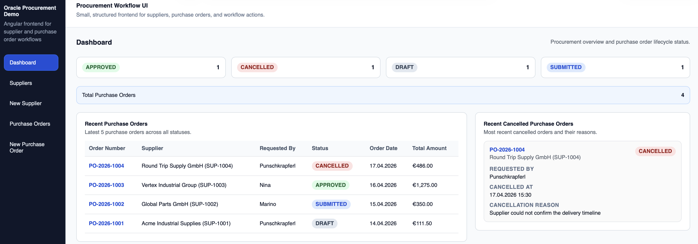
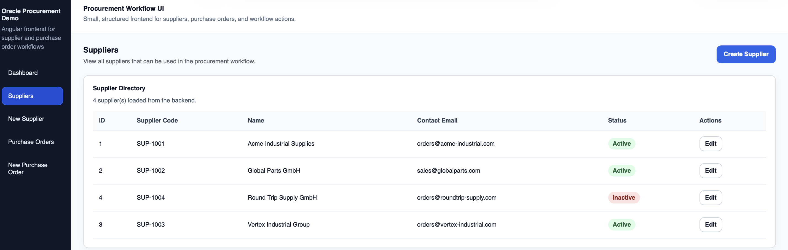
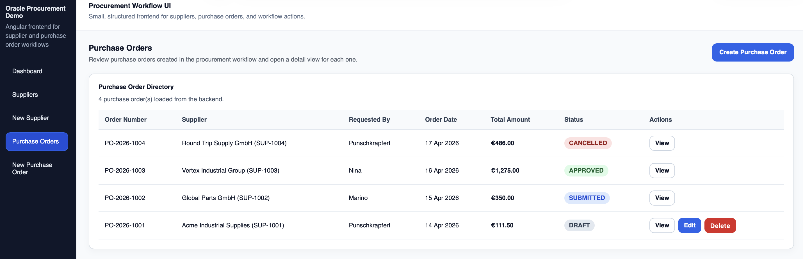
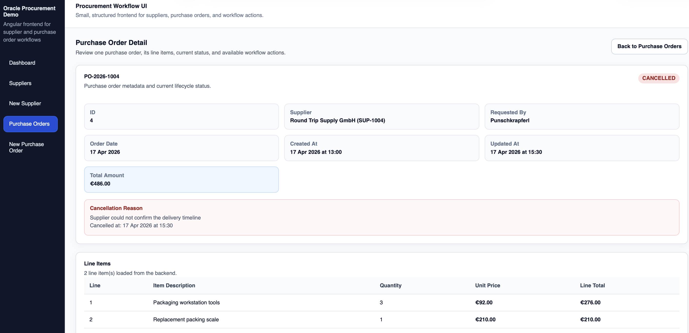
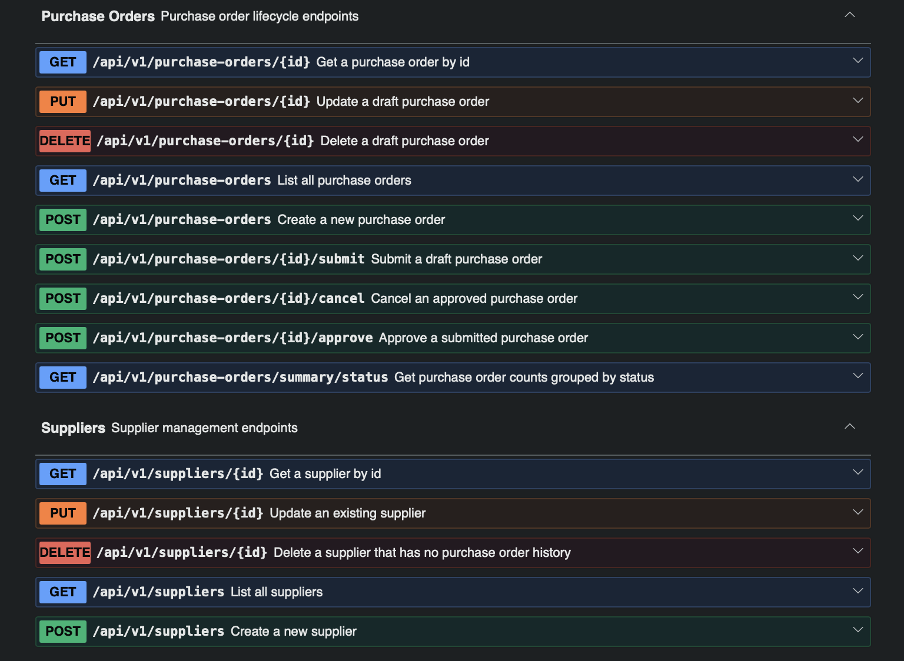
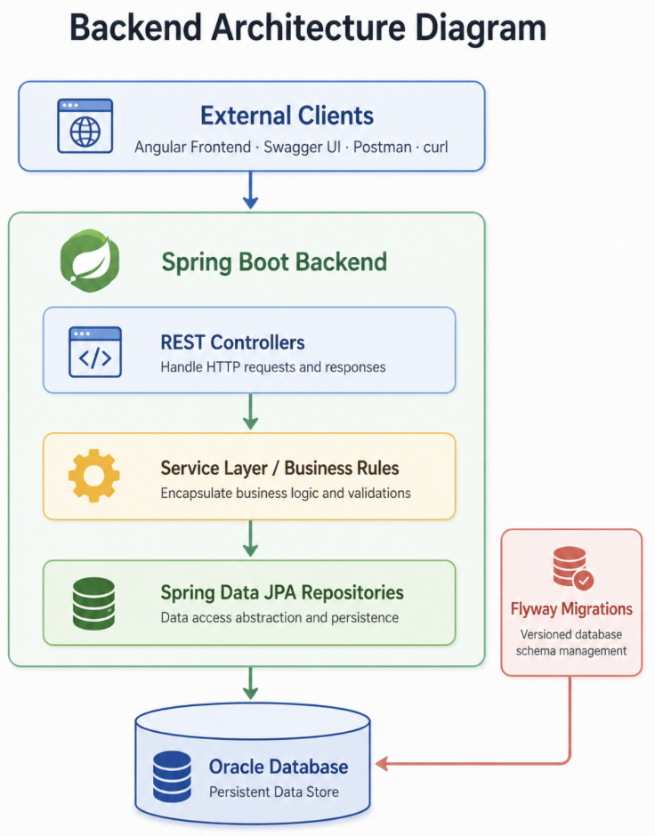

# Oracle Procurement Demo

A full-stack procurement workflow demo built with **Java 21**, **Spring Boot 4**, **Oracle Database**, **Spring Data JPA**, **Flyway**, **Angular 20**, **Swagger/OpenAPI**, and **Docker**.

The project models a small procurement workflow around **suppliers** and **purchase orders**. It is designed as a recruiter-friendly portfolio project with clear business rules, validation, persistence, tests, Docker setup, and a working Angular frontend.

---

## Overview

The application supports:

- supplier management
- purchase order management
- purchase order line items
- workflow actions:
  - submit
  - approve
  - cancel
- purchase order status summary
- Oracle-backed persistence with Flyway migrations
- optional demo seed data
- backend unit, controller, integration, and SQL seed tests
- Angular frontend with dashboard, suppliers, and purchase order screens
- frontend unit tests, Playwright end-to-end tests, and Dockerized frontend smoke tests
- separate demo and development runtime paths

---

## Tech stack

### Backend

- Java 21
- Spring Boot 4
- Spring Web MVC
- Spring Data JPA
- Oracle Database
- Flyway
- Hibernate Validator
- SpringDoc OpenAPI / Swagger UI
- JUnit 5
- Mockito
- AssertJ
- Maven

### Frontend

- Angular 20
- TypeScript
- Angular standalone components
- Angular signals
- Zoneless change detection
- Reactive forms
- CSS
- Karma / Jasmine
- Playwright
- nginx

### Infrastructure

- Docker
- Docker Compose
- Maven Wrapper
- npm

---

## Screenshots

### Dashboard

The dashboard shows purchase order status counts, recent purchase orders, and recently cancelled purchase orders.



### Suppliers

The supplier list shows supplier master data and whether each supplier is active or inactive.



### Purchase Orders

The purchase order list shows order numbers, suppliers, requesters, dates, total amounts, statuses, and available actions.



### Purchase Order Detail

The detail page shows purchase order metadata, line items, total amount, status, and cancellation history.



### Swagger / OpenAPI

The backend exposes interactive API documentation through Swagger UI.



---

## Architecture

### Backend



The backend follows a layered Spring Boot architecture:

```text
External Clients
  ↓
REST Controllers
  ↓
Service Layer / Business Rules
  ↓
Spring Data JPA Repositories
  ↓
Oracle Database
```

Flyway manages the database schema separately through versioned migrations.

More backend details are documented in:

- [Backend details](docs/backend_details.md)
- [API overview](docs/api_overview.md)

### Frontend


The Angular frontend communicates with the backend through REST endpoints.

The Angular frontend calls the backend through:

```text
/api/v1
```

In local development, Angular proxies `/api` requests to the Spring Boot backend.

In Docker frontend runtime, nginx serves the Angular production build and proxies `/api/` requests to the Spring Boot backend.

More frontend details are documented in:

- [Frontend details](docs/frontend_details.md)

---

## Main business rules

- Purchase orders can only be created for active suppliers.
- Supplier codes must be unique.
- Purchase order numbers must be unique.
- Duplicate purchase order line numbers are rejected.
- Only `DRAFT` purchase orders can be edited or deleted.
- Only `DRAFT` purchase orders can be submitted.
- Only `SUBMITTED` purchase orders can be approved.
- Only `APPROVED` purchase orders can be cancelled.
- Cancelled purchase orders require a cancellation reason and timestamp.
- Suppliers with purchase order history cannot be deleted.
- Suppliers with history should be deactivated instead of deleted.

Purchase order workflow:

```text
DRAFT -> SUBMITTED -> APPROVED -> CANCELLED
```

---

## Project structure

```text
oracle-procurement-demo
├─ docs
│  ├─ screenshots
│  │  ├─ backend_architecture.png
│  │  ├─ frontend_architecture.png
│  │  ├─ dashboard.png
│  │  ├─ suppliers-list.png
│  │  ├─ purchase-orders-list.png
│  │  ├─ purchase-order-detail-cancelled.png
│  │  └─ swagger-ui.png
│  ├─ backend_details.md
│  ├─ frontend_details.md
│  └─ api_overview.md
├─ frontend
│  ├─ src
│  ├─ e2e
│  ├─ e2e-docker
│  ├─ Dockerfile
│  ├─ docker-compose.yml
│  ├─ nginx.conf
│  ├─ proxy.conf.json
│  ├─ package.json
│  ├─ angular.json
│  ├─ playwright.config.ts
│  ├─ playwright.docker.config.ts
│  └─ tsconfig.e2e.json
├─ scripts
│  ├─ demo
│  └─ dev
├─ src
│  ├─ main
│  │  ├─ java/com/example/oracleprocurementdemo
│  │  └─ resources
│  │     ├─ db/migration
│  │     ├─ db/demo
│  │     ├─ application.yml
│  │     └─ application-dev.yml
│  └─ test
│     ├─ java/com/example/oracleprocurementdemo
│     └─ resources
├─ docker-compose.yml
├─ docker-compose-dev.yml
├─ Dockerfile
├─ pom.xml
└─ README.md
```

---

## Runtime modes

The project separates demo and development runtime paths.

### Demo runtime

Used for showing the project as a portfolio demo.

- Oracle runs in Docker.
- Backend runs through the demo Docker Compose setup.
- Environment variables use `DEMO_*`.
- Oracle is exposed on host port `1522`.
- Backend runs on port `8080`.

Main files:

```text
docker-compose.yml
.env.example
.env
scripts/demo/run-demo.sh
scripts/demo/stop-demo.sh
scripts/demo/reset-demo-db.sh
scripts/demo/seed-demo-data.sh
scripts/demo/run-demo-test.sh
```

### Development runtime

Used for active development.

- Oracle runs in Docker.
- Backend usually runs locally with Spring Boot.
- Environment variables use `DEV_*`.
- Oracle is exposed on host port `1521`.
- Backend runs on `DEV_APP_PORT`.

Main files:

```text
docker-compose-dev.yml
.env.dev
scripts/dev/run-dev.sh
scripts/dev/stop-dev.sh
scripts/dev/reset-dev-db.sh
scripts/dev/run-dev-test.sh
```

---

## Quick start

### Demo backend

Prerequisites:

- Docker Desktop installed and running
- port `8080` free
- port `1522` free

Start demo backend:

```bash
git clone https://github.com/Punschkrapferl/oracle-procurement-demo
cd oracle-procurement-demo

cp .env.example .env
./scripts/demo/run-demo.sh
```

Open Swagger UI:

```text
http://localhost:8080/swagger-ui.html
```

Open OpenAPI JSON:

```text
http://localhost:8080/v3/api-docs
```

Stop demo backend:

```bash
./scripts/demo/stop-demo.sh
```

Reset demo database:

```bash
./scripts/demo/reset-demo-db.sh
./scripts/demo/run-demo.sh
```

Run demo backend tests:

```bash
./scripts/demo/run-demo-test.sh
```

Load optional demo seed data:

```bash 
./scripts/demo/seed-demo-data.sh
```
---

### Development backend

Prerequisites:

- Docker Desktop installed and running
- Java 21 installed
- Maven Wrapper available
- port `8080` free
- port `1521` free

Create a local `.env.dev` file with the `DEV_*` variables, then run:

```bash
./scripts/dev/run-dev.sh
```

Stop development backend:

```bash
./scripts/dev/stop-dev.sh
```

Reset development database:

```bash
./scripts/dev/reset-dev-db.sh
```

Run development backend tests:

```bash
./scripts/dev/run-dev-test.sh
```

---

## Frontend quick start

### Local Angular runtime

Prerequisites:

- Node.js installed
- npm installed
- backend running on `http://localhost:8080`

Start frontend:

```bash
cd frontend
npm install
npm start
```

The frontend runs on:

```text
http://localhost:4200
```

The Angular proxy forwards API calls from:

```text
/api
```

to the backend running on:

```text
http://localhost:8080
```

Run Angular unit tests:

```bash
cd frontend
npm test
```

Run Playwright end-to-end tests:

```bash
cd frontend
npm run test:e2e
```

### Frontend Docker runtime

The frontend can also run as a Dockerized nginx build.

Prerequisites:

- Docker Desktop installed and running
- backend running on `http://localhost:8080`
- port `4200` free

Start frontend container:

```bash
cd frontend
docker compose up -d --build
```

The Dockerized frontend runs on:

```text
http://localhost:4200
```

Run the Dockerized frontend smoke test:

```bash
npm run e2e:docker
```

This test checks that:

- the Dockerized Angular frontend is reachable
- nginx serves the Angular production build
- Angular routes load correctly through nginx
- `/api/` requests are proxied to the backend
- the main frontend pages load without unexpected API failures

Stop frontend container:

```bash
cd frontend
docker compose down
```

---

## Demo seed data

The project includes optional demo seed data:

```text
src/main/resources/db/demo/V100__seed_demo_data.sql
```

This file is intentionally stored under `db/demo`, not `db/migration`.

That means Flyway does **not** run it automatically.

The seed script creates:

- 4 suppliers
- 4 purchase orders
- 8 purchase order lines
- one purchase order in each status:
  - `DRAFT`
  - `SUBMITTED`
  - `APPROVED`
  - `CANCELLED`

The script is useful for showing the dashboard, supplier list, purchase order list, and workflow detail pages with realistic demo data.

### Load demo seed data

Start the demo environment first:

```bash
./scripts/demo/run-demo.sh
```

Then load the optional seed data:

```bash
./scripts/demo/seed-demo-data.sh
```

The seed script is re-runnable. It deletes and reinserts only the fixed demo records defined in the script, not arbitrary business data.

If the script is not executable yet, run:

```bash
chmod +x scripts/demo/seed-demo-data.sh
```

### Seed data test

The seed SQL is covered by:

```text
src/test/java/com/example/oracleprocurementdemo/demo/DemoSeedDataSqlTest.java
```

Run backend demo tests through the demo script:

```bash
./scripts/demo/run-demo-test.sh
```

The test script loads the required Oracle database credentials from `.env`.

More details are in:

- [Backend details](docs/backend_details.md#optional-demo-seed-data)

---

## API overview

All backend endpoints are versioned under:

```text
/api/v1
```

Main endpoint groups:

- `/api/v1/suppliers`
- `/api/v1/purchase-orders`
- `/api/v1/purchase-orders/{id}/submit`
- `/api/v1/purchase-orders/{id}/approve`
- `/api/v1/purchase-orders/{id}/cancel`
- `/api/v1/purchase-orders/summary/status`

Full endpoint documentation:

- [API overview](docs/api_overview.md)
- Swagger UI: `http://localhost:8080/swagger-ui.html`

---

## Testing

### Backend tests

The backend includes:

- service unit tests with Mockito
- Web MVC controller tests
- Oracle-backed integration tests
- optional demo seed SQL test

Run backend tests:

```bash
./scripts/demo/run-demo-test.sh
```

or:

```bash
./scripts/dev/run-dev-test.sh
```

### Frontend tests

Run Angular unit tests:

```bash
cd frontend
npm test
```

Run Playwright end-to-end tests:

```bash
cd frontend
npm run test:e2e
```

Run the Dockerized frontend smoke test:

```bash
cd frontend
npm run e2e:docker
```

The Dockerized smoke test assumes that the backend and frontend container are already running. It verifies the real nginx-served frontend runtime instead of the Angular dev server.

---

## Notes

- This is a demonstration project, not a full procurement platform.
- The scope is intentionally small and practical.
- Oracle is included as part of the persistence setup.
- The backend API is versioned under `/api/v1`.
- Swagger/OpenAPI is included for convenient API exploration.
- The optional demo seed file is not an automatic Flyway migration.
- Demo and development paths are intentionally separated.
- The frontend can run locally through the Angular dev server or as a Dockerized nginx build.
- The frontend and backend are developed separately but work together as one full-stack application.
- The Dockerized frontend smoke test verifies the real nginx frontend container against the running backend.

---

## Future improvements

Possible future improvements:

- authentication and authorization
- audit logging
- richer filtering, sorting, and pagination
- CI pipeline automation
- dedicated isolated frontend test environment
- deployment beyond local Docker usage
- more advanced dashboard filtering and analytics

---

## License

MIT License

Copyright (c) 2026 Punschkrapferl

Permission is hereby granted, free of charge, to any person obtaining a copy
of this software and associated documentation files (the Software), to deal
in the Software without restriction, including without limitation the rights
to use, copy, modify, merge, publish, distribute, sublicense, and/or sell
copies of the Software, and to permit persons to whom the Software is furnished
to do so, subject to the following conditions:

The above copyright notice and this permission notice shall be included in all
copies or substantial portions of the Software.

THE SOFTWARE IS PROVIDED AS IS, WITHOUT WARRANTY OF ANY KIND, EXPRESS OR
IMPLIED, INCLUDING BUT NOT LIMITED TO THE WARRANTIES OF MERCHANTABILITY,
FITNESS FOR A PARTICULAR PURPOSE AND NONINFRINGEMENT. IN NO EVENT SHALL THE
AUTHORS OR COPYRIGHT HOLDERS BE LIABLE FOR ANY CLAIM, DAMAGES OR OTHER
LIABILITY, WHETHER IN AN ACTION OF CONTRACT, TORT OR OTHERWISE, ARISING FROM,
OUT OF OR IN CONNECTION WITH THE SOFTWARE OR THE USE OR OTHER DEALINGS IN THE
SOFTWARE.