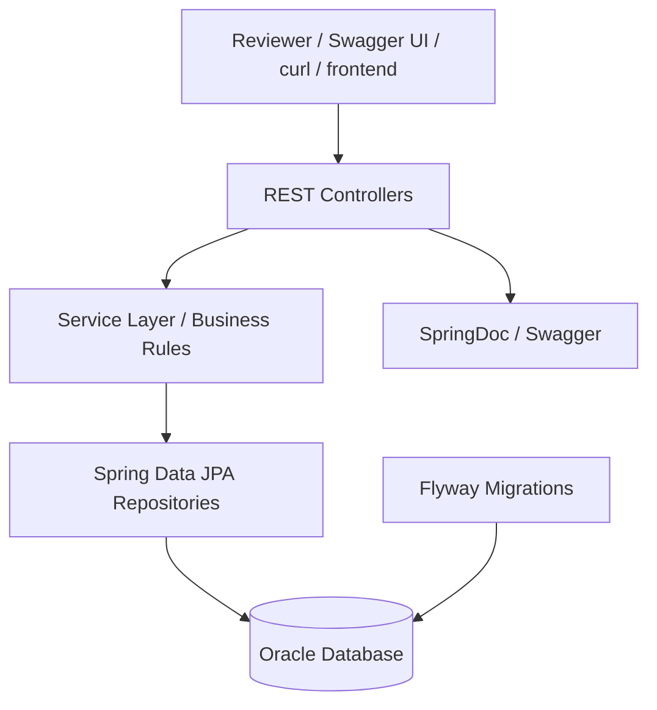
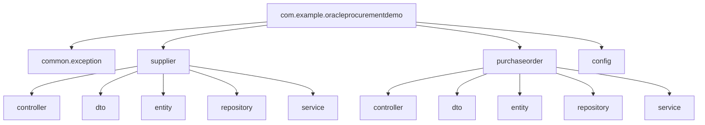

## Architecture


```mermaid
flowchart TD
    Client[Reviewer / Swagger UI / curl / frontend]
    Controller[REST Controllers]
    Service[Service Layer / Business Rules]
    Repository[Spring Data JPA Repositories]
    DB[(Oracle Database)]
    Flyway[Flyway Migrations]
    OpenAPI[SpringDoc / Swagger]

    Client --> Controller
    Controller --> Service
    Service --> Repository
    Repository --> DB
    Flyway --> DB
    Controller --> OpenAPI
```


And for your package structure, this is a good second diagram:

```md
## Package structure


```mermaid
flowchart TD
    Root[com.example.oracleprocurementdemo]

    Root --> Common[common.exception]
    Root --> Supplier[supplier]
    Root --> PurchaseOrder[purchaseorder]
    Root --> Config[config]

    Supplier --> SupplierController[controller]
    Supplier --> SupplierDto[dto]
    Supplier --> SupplierEntity[entity]
    Supplier --> SupplierRepository[repository]
    Supplier --> SupplierService[service]

    PurchaseOrder --> PurchaseOrderController[controller]
    PurchaseOrder --> PurchaseOrderDto[dto]
    PurchaseOrder --> PurchaseOrderEntity[entity]
    PurchaseOrder --> PurchaseOrderRepository[repository]
    PurchaseOrder --> PurchaseOrderService[service]
```

