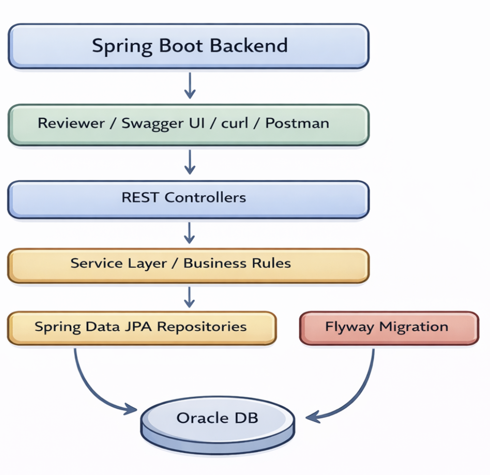
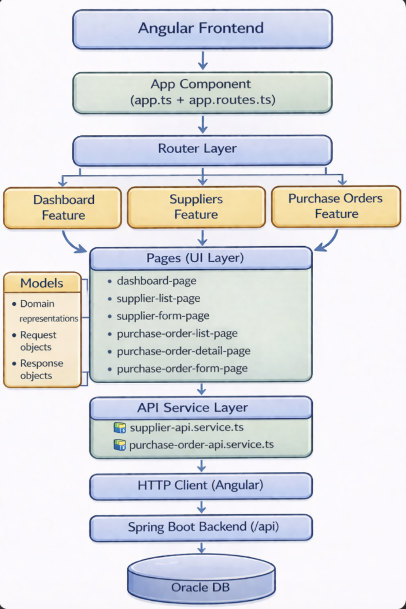

# Oracle Procurement Demo

A full-stack procurement workflow project built with **Java 21**, **Spring Boot 4**, **Oracle Database**, **Spring Data JPA**, **Flyway**, **Angular**, **Swagger/OpenAPI**, and **Docker**.

The application models a small procurement workflow around **suppliers** and **purchase orders**. The focus is on clean backend structure, business rules, validation, persistence, testing, and reproducible local setup.

---

## 1. Overview

This project includes:

- Supplier CRUD
- Purchase order CRUD
- Purchase order line items
- Purchase order workflow actions:
  - submit
  - approve
  - cancel
- Purchase order status summary endpoint
- Flyway database migrations
- Centralized validation and error handling
- Swagger/OpenAPI documentation
- Separate **demo** and **development** runtime paths
- Angular frontend with dashboard, supplier, and purchase order pages
- Dockerized frontend served through nginx

---

## 2. Tech stack

### Backend
- Java 21
- Spring Boot 4
- Spring Web MVC
- Spring Data JPA
- Oracle Database
- Flyway
- Hibernate Validator
- SpringDoc OpenAPI / Swagger UI
- JUnit 5
- Mockito

### Frontend

- Angular
- TypeScript
- Angular standalone components
- Angular signals
- HTML
- CSS
- nginx

### Infrastructure

- Docker 
- Docker Compose
- Maven
- npm

---

## 3. Architecture overview

### Backend



### Backend structure and data flow

The Spring Boot backend follows a layered feature-based structure:

- Endpoints are exposed through REST controllers
- Each business feature (`supplier`, `purchaseorder`) is organized into controller, dto, entity, repository, and service packages
- Controllers handle HTTP requests and responses
- Services contain business rules, validation, and workflow logic
- Repositories handle persistence through Spring Data JPA
- Flyway manages database schema migrations
- Oracle Database stores the persistent application data

Data flow:

HTTP request → REST controller → Service layer → Repository → Oracle DB → Repository result → Service layer → REST response

For workflow actions, the flow is the same, with business rules enforced in the service layer before data is persisted or returned.

A purchase order starts in `DRAFT` status and can move through a small workflow.

Example lifecycle:

`DRAFT -> SUBMITTED -> APPROVED`

Cancellation is also supported according to the business rules implemented in the service layer.

### Frontend



### Frontend structure and data flow

The Angular frontend follows a feature-based structure:

- Routing is handled in `app.routes.ts`
- Each feature (dashboard, suppliers, purchase orders) contains its own pages
- Pages act as UI containers and interact with API services
- API services handle HTTP communication with the backend
- Models provide type-safe request/response structures

Data flow:

User interaction → Page component → API service → HttpClient → Backend → Response → UI update

### Frontend and backend interaction

The project follows a simple full-stack architecture:

- the **Angular frontend** provides the user interface
- the frontend communicates with the **Spring Boot backend** through REST endpoints under `/api`
- the **Spring Boot backend** contains the business logic, validation, workflow rules, and persistence layer
- the backend connects to the **Oracle database**
- the frontend can be served locally with Angular dev tools or containerized with **nginx**

---

## 4. Project structure

### Backend

```text
src
├─ main
│  ├─ java/com/example/oracleprocurementdemo
│  │  ├─ common/exception
│  │  ├─ config
│  │  ├─ supplier
│  │  │  ├─ controller
│  │  │  ├─ dto
│  │  │  ├─ entity
│  │  │  ├─ repository
│  │  │  └─ service
│  │  └─ purchaseorder
│  │     ├─ controller
│  │     ├─ dto
│  │     ├─ entity
│  │     ├─ repository
│  │     └─ service
│  └─ resources
│     ├─ db/migration
│     ├─ application.yml
│     └─ application-dev.yml
└─ test
   ├─ java/com/example/oracleprocurementdemo
   └─ resources
      ├─ application-test.yml
      └─ application-test-dev.yml
```

### Frontend 

```text
frontend
├─ src
│  ├─ app
│  │  ├─ core
│  │  │  ├─ api
│  │  │  └─ config
│  │  ├─ models
│  │  └─ features
│  │     ├─ dashboard
│  │     ├─ suppliers
│  │     └─ purchase-orders
│  ├─ environments
│  ├─ index.html
│  └─ styles.css
├─ e2e
├─ public
├─ dist
│  └─ frontend
│     └─ browser
├─ Dockerfile
├─ docker-compose.yml
├─ nginx.conf
├─ proxy.conf.json
├─ package.json
├─ playwright.config.ts
└─ angular.json
```

---

## 5. Runtime paths

The project currently supports separate runtime modes.

### Demo runtime

The demo runtime is intended for showing the full application flow.
* Oracle runs in Docker
* the backend runs locally or in its own demo path, depending on setup
* the frontend can run locally or in Docker
* the frontend Docker setup uses nginx
* the frontend proxies `/api` to the backend

### Development runtime

The development runtime is intended for active implementation work.
* Oracle runs in Docker
* the backend runs locally with Spring Boot
* the frontend runs locally with Angular
* the active Spring profile is dev

---

## 6. Configuration

The project uses separate configuration for backend runtime modes and a dedicated frontend setup.

### Environment files

* `.env.example`
  template for the demo setup

* `.env.demo`
  local demo runtime configuration

* `.env`
  local development runtime configuration

### Spring config files

* `application.yml`
  default/demo runtime using `DEMO_*`

* `application-dev.yml`
  development runtime using `DEV_*`

* `application-test.yml`
  demo test configuration

* `application-test-dev.yml`
  development test configuration

### Frontend runtime notes
- local frontend development runs with Angular tooling
- Docker frontend is served with nginx
- Angular build output is generated into:

```text
dist/frontend/browser
```

---

## 7. Quick start

### 7.1 Demo runtime

This is the simplest way to run the project.

#### Prerequisites

* Docker Desktop installed and running
* port `8080` free
* port `1522` free

#### Start

Clone repo:
```bash
git clone https://github.com/Punschkrapferl/oracle-procurement-demo
cd oracle-procurement-demo
```

Start backend demo:
```bash
cp .env.example .env.demo
./scripts/demo/run-demo.sh
```

#### Open API documentation

* Swagger UI: `http://localhost:8080/swagger-ui.html`
* OpenAPI docs: `http://localhost:8080/v3/api-docs`

#### Frontend Docker runtime

The frontend can also be run in Docker and served through nginx.

##### Prerequisites

* Docker Desktop installed and running
* backend already reachable
* port 4200 free

Start frontend in Docker:

```bash 
cd frontend
docker compose up -d
```

The Dockerized frontend runs on:
- `http://localhost:4200`
In this setup, nginx handles the frontend and proxies `/api` requests to the backend.

#### Stop

```bash
./scripts/demo/stop-demo.sh
```

#### Reset demo database

```bash
./scripts/demo/reset-demo-db.sh
./scripts/demo/run-demo.sh
```

#### Run demo tests for backend
```bash
./scripts/demo/run-demo-test.sh
```

#### Run Angular unit test suite 
```bash
cd frontend
npm install
npm test
```

#### Run e2e-tests for frontend
```bash 
cd frontend
npx playwright test
```

#### Stop frontend Docker container
```bash
cd frontend
docker compose down
```

---

### 7.2 Development runtime

#### Backend local development

##### Prerequisites

* Docker Desktop installed and running
* Java 21 installed
* Maven wrapper available
* port `8080` free
* port `1521` free

##### Start

Create a local `.env` file with the `DEV_*` variables, then run:

```bash
./scripts/dev/run-dev.sh
```

Open API documentation:
- Swagger UI: `http://localhost:8080/swagger-ui.html`
- OpenAPI docs: `http://localhost:8080/v3/api-docs`

##### Stop

```bash
./scripts/dev/stop-dev.sh
```

#### Reset development database

```bash
./scripts/dev/reset-dev-db.sh
```

#### Run development tests

```bash
./scripts/dev/run-dev-test.sh
```

#### Frontend local development

This path is useful when working on the Angular UI.

##### Prerequisites
- Node.js installed
- npm installed
- backend already running on `http://localhost:8080`

Start frontend:
```bash 
cd frontend
npm install
npm start
```

The frontend runs on:
- `http://localhost:4200`

In local development, the Angular frontend talks to the backend running on:
- `http://localhost:8080`

Run Angular unit test suite:
```bash
cd frontend
npm install
npm test
```

Run end-to-end tests:
```bash 
cd frontend
npx playwright test 
```

Stop the frontend with:
```text
Ctrl + C
```

---

## 8. Docker setup

### Backend and database files

* `docker-compose.yml`
* `docker-compose-dev.yml`
* `Dockerfile`
* `.dockerignore`

### Frontend files

* `frontend/docker-compose.yml`
* `frontend/Dockerfile`
* `frontend/nginx.conf`
* `frontend/.dockerignore`

### Runtime behavior

The project uses Docker in different ways depending on the runtime path:

#### Demo runtime
- Oracle runs in Docker
- the backend demo setup is started through the demo scripts and compose configuration
- the frontend can be started separately from the `frontend` folder with Docker Compose
- nginx serves the Angular production build and proxies `/api` requests to the backend

#### Development runtime
- Oracle runs in Docker
- the backend runs locally with Spring Boot
- the frontend usually runs locally with Angular dev tooling
- the frontend can also be started in Docker if needed

### Frontend container behavior

The Dockerized frontend serves the Angular production build through nginx.

Angular build output:

```text
dist/frontend/browser
````

The frontend is exposed on:

* `http://localhost:4200`

### Container networking

The frontend does not connect to Oracle directly.

The communication flow is:

```text
Browser → Angular Frontend → Spring Boot Backend → Oracle Database
```

When the frontend runs in Docker:

* nginx serves the Angular app
* requests to `/api` are proxied to the backend

When the backend connects to Oracle inside Docker, it uses the Oracle service name and internal Oracle port, for example:

```text
jdbc:oracle:thin:@oracle:1521/FREEPDB1
```

Important distinction:

* `1521` is the Oracle port inside Docker
* `1522` is the host port exposed for local machine access in the demo runtime
* `4200` is the frontend port exposed to the browser

---

## 9. API endpoints

### Suppliers

* `GET /api/suppliers`
* `GET /api/suppliers/{id}`
* `POST /api/suppliers`
* `PUT /api/suppliers/{id}`
* `DELETE /api/suppliers/{id}`

### Purchase orders

* `GET /api/purchase-orders`
* `GET /api/purchase-orders/{id}`
* `POST /api/purchase-orders`
* `PUT /api/purchase-orders/{id}`
* `DELETE /api/purchase-orders/{id}`

### Workflow actions

* `POST /api/purchase-orders/{id}/submit`
* `POST /api/purchase-orders/{id}/approve`
* `POST /api/purchase-orders/{id}/cancel`

### Summary

* `GET /api/purchase-orders/summary/status`

### Frontend coverage

The Angular frontend uses these backend endpoints to support:

* supplier list and create/edit flows
* purchase order list, detail, and create/edit flows
* workflow actions such as submit, approve, and cancel
* dashboard and overview pages

This section is intentionally a high-level API overview. Full request and response details can be explored through Swagger UI.

---

## 10. Example flow

A typical application flow looks like this:

1. Start Oracle
2. Start the backend
3. Start the frontend
4. Create a supplier
5. Create a purchase order linked to that supplier
6. Submit the purchase order
7. Approve or cancel it
8. View the updated state in the frontend
9. Check the status summary endpoint if needed

---

## 11. Testing

The project includes backend tests, Angular unit tests, and frontend end-to-end tests.

### Backend tests

The backend test setup covers several layers:

* service unit tests with Mockito
* Web MVC controller tests
* integration tests with Oracle-backed application setup

Run backend tests for the demo-oriented path:

```bash
./scripts/demo/run-demo-test.sh
```

Run backend tests for the development-oriented path:

```bash
./scripts/dev/run-dev-test.sh
```

### Frontend unit tests

Frontend unit testing covers Angular component tests and service tests.

Typical examples include:

* page/component tests
* app shell tests
* API service tests

Run Angular unit tests with:

```bash
cd frontend
npm install
npm test
```

### Frontend end-to-end tests

End-to-end tests use Playwright and validate the frontend workflow against the running backend.

Typical coverage includes:

* navigation
* supplier flow
* purchase order flow
* smoke tests

Run Playwright tests with:

```bash
cd frontend
npx playwright test
```

Important note:

The current e2e tests create test data and do not automatically clean it up afterward. Because of that, the UI may accumulate Playwright-created suppliers and purchase orders over time.

That is acceptable during development, but cleaner approaches would be:

* resetting the test database before each e2e run
* cleaning up created test data after execution
* using a dedicated test environment or test database

---

## 12. Notes

* This is a demonstration project, not a full procurement platform
* The scope is intentionally small and practical
* Oracle is included as part of the persistence setup
* Swagger/OpenAPI is included for convenient API exploration
* The frontend and backend are developed separately but work together as one full-stack application
* The frontend can run either locally with Angular tooling or in Docker with nginx
* Demo and development paths are intentionally separated to keep runtime behavior explicit

---

## 13. Future improvements

Potential next steps outside the current scope:

* authentication and authorization
* audit logging
* richer filtering, sorting, and pagination
* CI pipeline automation
* improved dashboard analytics
* dedicated isolated frontend test environment
* deployment beyond local Docker usage

---

## License

MIT License

Copyright (c) 2026 Punschkrapferl

Permission is hereby granted, free of charge, to any person obtaining a copy
of this software and associated documentation files (the "Software"), to deal
in the Software without restriction, including without limitation the rights
to use, copy, modify, merge, publish, distribute, sublicense, and/or sell
copies of the Software, and to permit persons to whom the Software is furnished
to do so, subject to the following conditions:

The above copyright notice and this permission notice shall be included in all
copies or substantial portions of the Software.

THE SOFTWARE IS PROVIDED "AS IS", WITHOUT WARRANTY OF ANY KIND, EXPRESS OR
IMPLIED, INCLUDING BUT NOT LIMITED TO THE WARRANTIES OF MERCHANTABILITY,
FITNESS FOR A PARTICULAR PURPOSE AND NONINFRINGEMENT. IN NO EVENT SHALL THE
AUTHORS OR COPYRIGHT HOLDERS BE LIABLE FOR ANY CLAIM, DAMAGES OR OTHER
LIABILITY, WHETHER IN AN ACTION OF CONTRACT, TORT OR OTHERWISE, ARISING FROM,
OUT OF OR IN CONNECTION WITH THE SOFTWARE OR THE USE OR OTHER DEALINGS IN THE
SOFTWARE.

